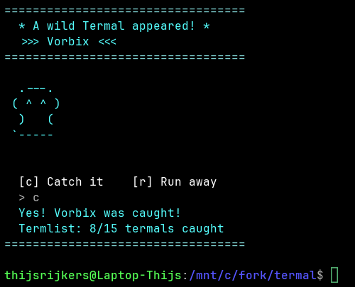

# Termal

Termal adds wild creature encounters to your terminal. Every time you run a command, there is a small chance (about 1 in 7) that a wild Termal shows up. You can catch it or run away. There are 15 different Termals to find.

Your progress is saved on disk, so closing your terminal or restarting your PC will not lose your caught Termals or your enabled/disabled setting.



---

## How it works

- After every command you type, Termal rolls a dice in the background
- If you get lucky, a creature appears with its name and ASCII art
- You press **c** to catch it or **r** to run away
- If you already caught that Termal before, catching it again does nothing
- Type `termal-list` any time to see which ones you have caught so far

---

## Install

Put `termal.sh` and `install.sh` in the same folder, then run:

```bash
chmod +x install.sh
./install.sh
```

Then activate it for your current session:

```bash
source ~/.bashrc
```

> If you use zsh, the installer will automatically add it to `~/.zshrc` instead.

After that, Termal is active every time you open a terminal.

---

## Commands

| Command | What it does |
|---|---|
| `termal-enable` | Turn encounters on |
| `termal-disable` | Turn encounters off |
| `termal-list` | Show all 15 Termals and which ones you have caught |
| `termal-help` | Show available commands |

---

## The 15 Termals

| # | Name | # | Name |
|---|---|---|---|
| 01 | Vorbix | 09 | Blazzop |
| 02 | Quelsh | 10 | Crumfish |
| 03 | Drantu | 11 | Yeldrop |
| 04 | Fiznak | 12 | Huffnug |
| 05 | Mopple | 13 | Skvork |
| 06 | Grubzel | 14 | Plontle |
| 07 | Snorvik | 15 | Wazzit |
| 08 | Twemlo | | |